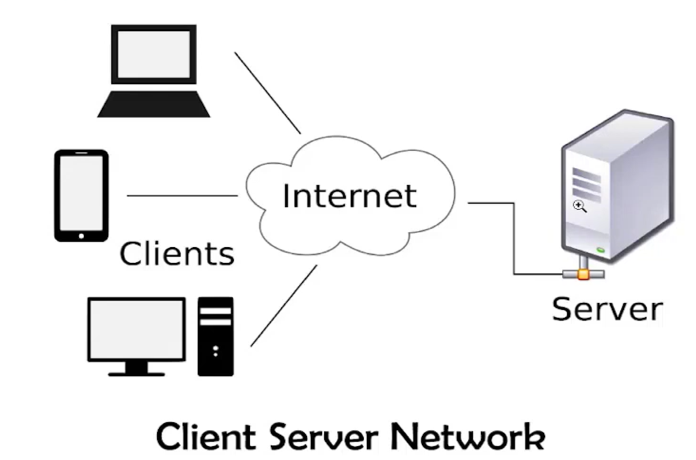
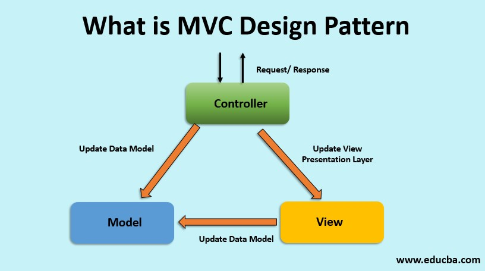

## Express Framework for Nodejs

# client-server



```
const bodyParser = require('body-parser);
const morgan = require('morgan')
//import express
const express = require('express');

//rest obj
const app = express();
// middlewares
app.use(express.json());
app.use(bodyParser.urlencoded({extended: false}));
app.use(moragan("dev"))
// or we can use

// get method

app.get('/",(req, res)=>{
    res.send"<h1>hello world</h1>");
})

//post request
app.post("/contact-form", (req, res)=>{
    const{user} = req.body;

res.json({
success: true,
message:` User ${user} `
})
})
const PORT = 3000;

const app.listen(PORT, ()=>{
    console.log(`server is running on port  ${PORT}`)
})

```

- install package, nodemon, express

- body-parser
- npm i body-parser
- morgan (npm i morgan)

## MVC Pattern, converting our app to MVC



## example to create get request with different route

```
const express = require('express');

const app = express();

const port = 3000;

app.get('/', (req, res) => {
  res.send('<h1>This is heading one</h1>');
});

app.get('/about', (req, res) => {
  res.send('<h1>This  is about page</h1>');
});

app.get('/contact', (req, res) => {
  res.send('<h1>This is contact page</h1>');
});
app.listen(port, () => {
  console.log('server is runnning in port', port);
});

```

## post request

```
// index.js

const express = require('express');
const path = require('path');
const bodyParser = require('body-parser');
const app = express();

const port = 3000;
app.use(bodyParser.urlencoded({ extended: false }));

app.get('/', (req, res) => {
  res.sendFile(path.join(__dirname + '/form.html'));
});

// app.get('/about', (req, res) => {
//   res.send('<h1>This  is about page</h1>');
// });

// app.get('/contact', (req, res) => {
//   res.send('<h1>This is contact page</h1>');
// });

app.post('/api/v1/login', (req, res) => {
  res.send(
    `<h1>Done Mr. ${req.body.name}</h1>
    <h2>Your email is ${req.body.email}</h2>
    <h3>Your password is ${req.body.password}</h3>`
  );
  console.log(req.body);
});

// server connected
app.listen(port, () => {
  console.log('server is runnning in port', port);
});

//form.html

<!DOCTYPE html>
<html lang="en">
  <head>
    <meta charset="UTF-8" />
    <meta http-equiv="X-UA-Compatible" content="IE=edge" />
    <meta name="viewport" content="width=device-width, initial-scale=1.0" />
    <title>Form</title>
    <style>
      form {
        max-width: 300px;
        padding: 20px;
        background-color: beige;
        margin: 0 auto;
        border-radius: 6px;
        display: flex;
        gap: 12px;
        flex-direction: column;
      }

      input {
        display: block;
        padding: 6px;
      }

      input[type='submit'] {
        padding: 6px 24px;
        cursor: pointer;
      }
    </style>
  </head>
  <body>
    <form action="/api/v1/login" method="POST">
      <input type="text" name="name" id="name" placeholder="Enter your name" />
      <input
        type="email"
        name="email"
        id="email"
        placeholder="Enter your email"
      />
      <input
        type="password"
        name="password"
        id="password"
        placeholder="Enter your password"
      />
      <input type="submit" name="login" value="Login" />
    </form>
  </body>
</html>

```

# PUT

to update the data

# DELETE

Delete method to delete the data

# Rest API

REST (Representational State Transfer) is an API that defines a set of functions that programmers can use to send requests and receive responses using the HTTP protocol methods such as GET, POST, PUT, DELETE

## What is meant by REST API?

RESTful API is an interface that two computer systems use to exchange information securely over the internet. Most business applications have to communicate with other internal and third-party applications to perform various tasks.
